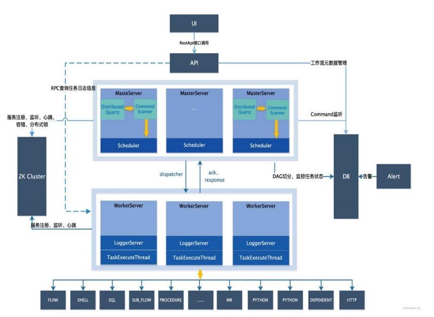

  <h1 align="center">DolphinScheduler工作流任务调度平台</h1>
  

    <a href="README.md"><strong>English</strong></a> | <strong>简体中文</strong>
  

## 目录

- [仓库简介](#项目介绍)
- [前置条件](#前置条件)
- [镜像说明](#镜像说明)
- [获取帮助](#获取帮助)
- [如何贡献](#如何贡献)

## 项目介绍
‌[Apache DolphinScheduler‌](https://github.com/apache/dolphinscheduler) 是一个分布式和可扩展的开源工作流协调平台，具有强大的DAG可视化界面，致力于解决数据管道中复杂的任务依赖关系，并提供“开箱即用”的各种类型的作业。

**核心特性：**
1. 以DAG图的⽅式将Task按照任务的依赖关系关联起来，可实时可视化监控任务的运⾏状态。
2. ‌⽀持丰富的任务类型：Shell、MR、Spark、SQL(mysql、postgresql、hive、sparksql),Python,Sub_Process、Procedure、Flink 和 http Task等。
3. ‌实现集群HA，通过Zookeeper实现Master集群和Worker集群去中⼼化。
4. ‌⽀持⼯作流定时调度、依赖调度、⼿动调度、⼿动暂停/停⽌/恢复，同时⽀持失败重试/告警、从指定节点恢复失败、Kill任务等操作。

**架构设计：**

本项目提供的开源镜像商品 [**DolphinScheduler工作流任务调度平台**](https://marketplace.huaweicloud.com/hidden/contents/31496fe8-a3c9-402a-863f-4b786940a410#productid=OFFI1121281616205033472)，已预先安装 DolphinScheduler 软件及其相关运行环境，并提供部署模板。快来参照使用指南，轻松开启“开箱即用”的高效体验吧。

> **系统要求如下：**
> - CPU: 2GHz 或更高
> - RAM: 4GB 或更大
> - Disk: 至少 40GB

## 前置条件
[注册华为账号并开通华为云](https://support.huaweicloud.com/usermanual-account/account_id_001.html)

## 镜像说明

| 镜像规格                                                                                                                                 | 特性说明                                           | 备注 |
|--------------------------------------------------------------------------------------------------------------------------------------|------------------------------------------------| --- |
| [dolphinscheduler-3.1_EulerOS2.0](https://marketplace.huaweicloud.com/hidden/contents/31496fe8-a3c9-402a-863f-4b786940a410#productid=OFFI1126343634183368704) | 基于 鲲鹏服务器 + Huawei Cloud EulerOS 2.0 64bit 安装部署 |  |
| [dolphinscheduler-3.1_Ubuntu24.04](https://marketplace.huaweicloud.com/hidden/contents/31496fe8-a3c9-402a-863f-4b786940a410#productid=OFFI1126343526060834816) | 基于 鲲鹏服务器 + Ubuntu24.04 64bit 安装部署              |  |
| [DolphinScheduler3.2.2-x86-v1.0](https://marketplace.huaweicloud.com/hidden/contents/31496fe8-a3c9-402a-863f-4b786940a410#productid=OFFI1126343526060834816) | 基于X86 + CentOS 7.6 64bit 安装部署                            |  |

## 获取帮助
- 更多问题可通过 [issue](https://github.com/HuaweiCloudDeveloper/dolphinscheduler-image/issues) 或 华为云云商店指定商品的服务支持 与我们取得联系
- 其他开源镜像可看 [open-source-image-repos](https://github.com/HuaweiCloudDeveloper/open-source-image-repos)

## 如何贡献
- Fork 此存储库并提交合并请求
- 基于您的开源镜像信息同步更新 README.md
