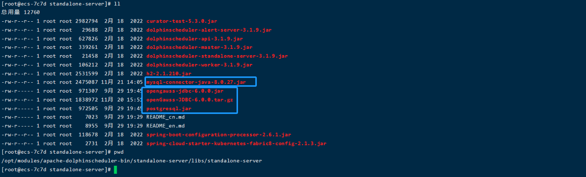
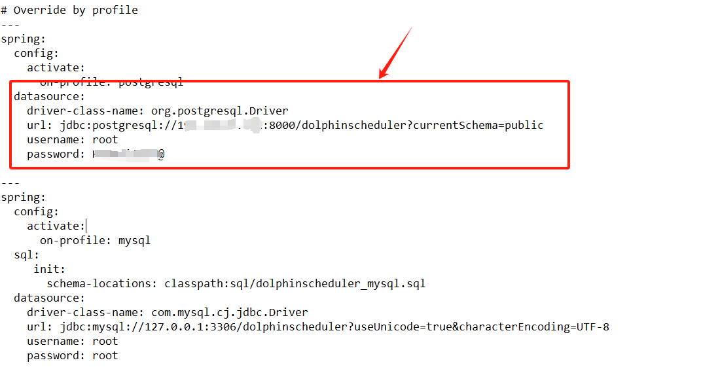

# DolphinScheduler适配gaussdb指南

## ‌一、环境准备
### 系统配置
> -  服务器架构：X86
> -  操作系统：CentOS 7.6 64bit
> - CPU: 2vCPUs 或更高
> - RAM: 4GB 或更大
> - Disk: 至少 40GB
### 安装包下载


```bash
# 下载二进制包解压
wget https://mirrors.aliyun.com/apache/dolphinscheduler/3.2.2/apache-dolphinscheduler-3.2.2-bin.tar.gz
tar -zxvf apache-dolphinscheduler-3.2.0-bin.tar.gz -C /opt

```

### 添加驱动包
下载mysql驱动和和gaussdb驱动
```bash
cd /opt
wget https://raw-cdn.gitcode.com/open-source-toolkit/d9426/blobs/53635e1307cb428a7d88d73b9c4b9e8041e47a99/mysql-connector-java-8.0.27-jar.zip
wget https://dws.obs.myhuaweicloud.com/download/dws_8.1.x_jdbc_driver.zip
```

解压缩后 将mysql驱动（后续任务将使用mysql的数据 抽取到gaussdb中）和gaussdb驱动 放到standalone-server/libs/standalone-server 目录下面


### 配置Gaussdb
进入到standalone-server/bin目录中 找到start.sh启动脚本   并且修改standalone-server/conf 目录下面的application.yaml文件 在配置文件中新增配置项



