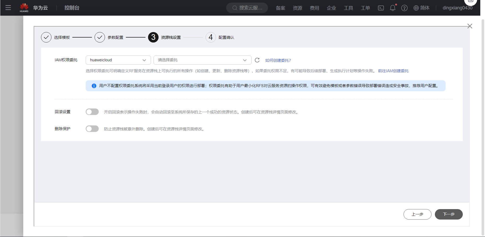
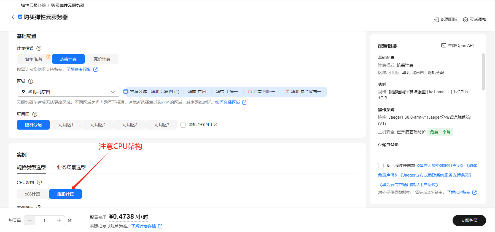
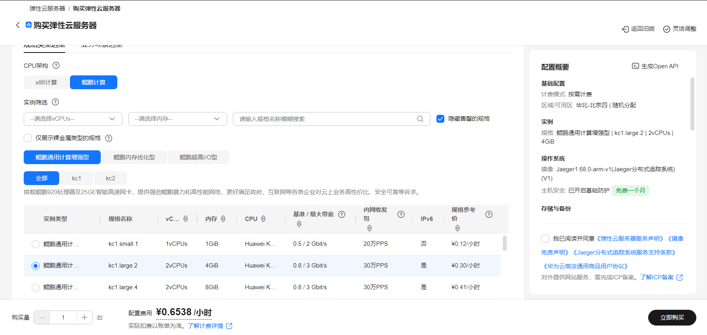
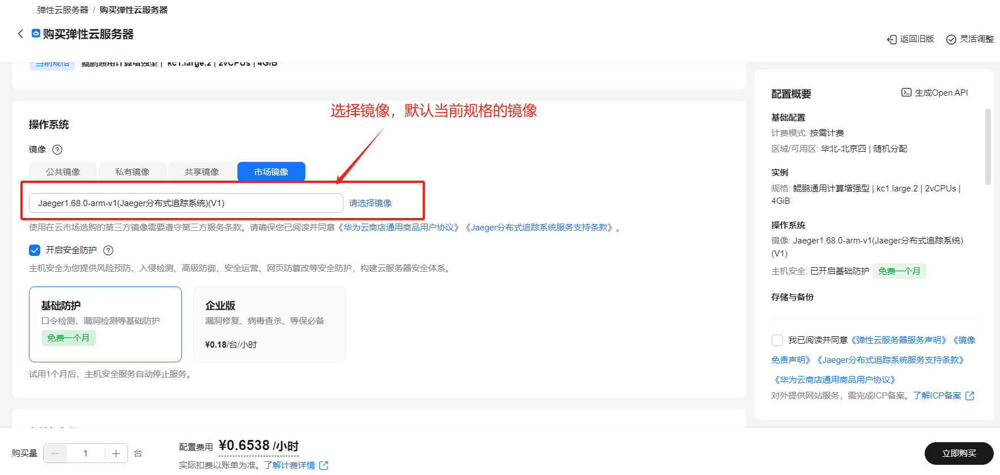
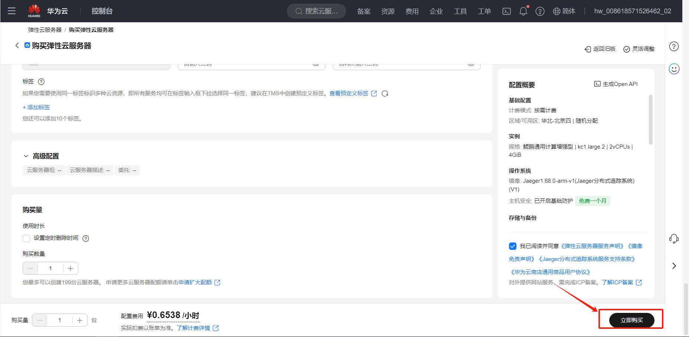
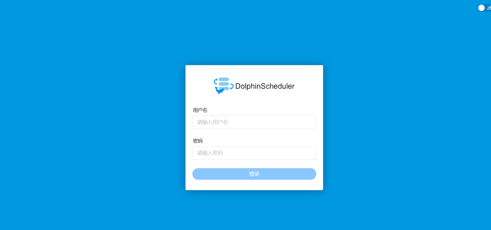
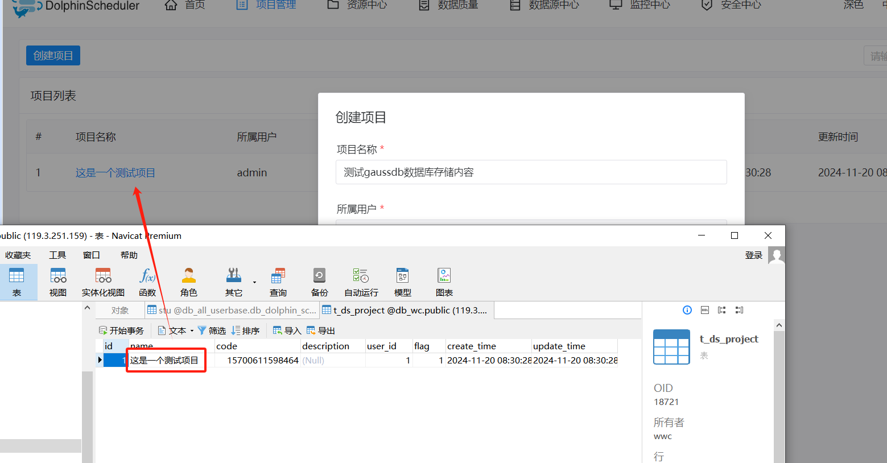
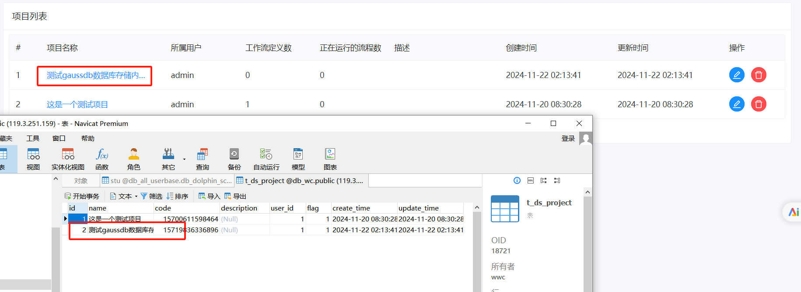

# DolphinScheduler工作流任务调度平台使用指南

# 一、商品链接

[DolphinScheduler工作流任务调度平台](https://marketplace.huaweicloud.com/hidden/contents/31496fe8-a3c9-402a-863f-4b786940a410#productid=OFFI1121281618467303424)

# 二、商品说明

**DolphinScheduler** 是现代数据编排平台。它能够以低代码创建高性能敏捷工作流。

# 三、商品购买

您可以在云商店搜索 **DolphinScheduler工作流任务调度平台**。

其中，地域、规格、推荐配置使用默认，购买方式根据您的需求选择按需/按月/按年，短期使用推荐按需，长期使用推荐按月/按年，确认配置后点击“立即购买”。


## 3.1 使用 RFS 模板直接部署

必填项填写后，点击 下一步


创建直接计划后，点击 确定


点击部署，执行计划

如下图“Apply required resource success. ”即为资源创建完成

# 3.2ECS 控制台配置

### 准备工作

在使用ECS控制台配置前，需要您提前配置好 **安全组规则**。

> **安全组规则的配置如下：**
> - 入方向规则放通端口12345，源地址内必须包含您的客户端ip，否则无法访问
> - 入方向规则放通 CloudShell 连接实例使用的端口 `22`，以便在控制台登录调试
> - 出方向规则一键放通

### 创建ECS

前提工作准备好后，选择 ECS 控制台配置跳转到[购买ECS](https://support.huaweicloud.com/qs-ecs/ecs_01_0103.html) 页面，ECS 资源的配置如下图所示：

选择CPU架构

选择服务器规格

选择镜像

其他参数根据实际请客进行填写，填写完成之后，点击立即购买即可



> **值得注意的是：**
> - VPC 您可以自行创建
> - 安全组选择 [**准备工作**](#准备工作) 中配置的安全组；
> - 弹性公网IP选择现在购买，推荐选择“按流量计费”，带宽大小可设置为5Mbit/s；
> - 高级配置需要在高级选项支持注入自定义数据，所以登录凭证不能选择“密码”，选择创建后设置；
> - 其余默认或按规则填写即可。

# 商品使用

## DolphinScheduler连接gaussdb

### Gaussdb初始化
在gaussdb数据库中选择已经配置好的数据库和Schema,执行[文件](../scripts/dolphinscheduler_postgresql.txt)中的sql，进行数据初始化

### 配置完成后的启动命令
```bash
# 启动 Standalone Server 服务
bash ./bin/dolphinscheduler-daemon.sh start standalone-server
# 停止 Standalone Server 服务
bash ./bin/dolphinscheduler-daemon.sh stop standalone-server
# 查看 Standalone Server 状态
bash ./bin/dolphinscheduler-daemon.sh status standalone-server
```
### 使用验证
启动之后 就可以访问页面了http://xxx.xx.xxx.x:12345/dolphinscheduler/ui/  账号和密码：  admin  dolphinscheduler123


接下来我们创建一个项目 并且将项目的内容保存到gaussdb数据库中 目前数据库中只有一个项目 创建之后 刷新数据库 可以看到 已经成功的将任务信息保存到gaussdb数据库中了




### 参考文档

[dolphinscheduler官网](https://dolphinscheduler.apache.org/zh-cn)
